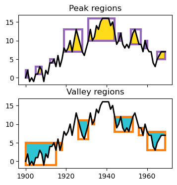

# Hierarchical Peak Finding

The file [hierarchical_peaks.py](hierarchical_peaks.py) is the core Python module for detecting peaks in numeric data. It constructs tree objects to represent how peaks in data are grouped and how larger peaks contain smaller subpeaks.

Requires Python 3.8+

## Howto files
For tutorials and documentation of the usage, jupyter notebooks are (or will be) included:
* [How_to_plot_with_matplotlib.ipynb](How_to_plot_with_matplotlib.ipynb)
* [dataframes_tutorial.ipynb](dataframes_tutorial.ipynb)

## Citation
In publications, please cite the current homepage of this software,

* https://github.com/eivindtostesen/hierarchical_peak_finding

and this open-access article:

>Tøstesen, E.
>A stitch in time: Efficient computation of genomic DNA melting bubbles.
>*Algorithms for Molecular Biology*, 3, 10 (2008).
>[DOI: 10.1186/1748-7188-3-10](http://dx.doi.org/10.1186/1748-7188-3-10)

## Authors
* Eivind Tøstesen, <contact@tostesen.no>

## Copying and license
Copyright 2021 Eivind Tøstesen.

License: GPL v3
